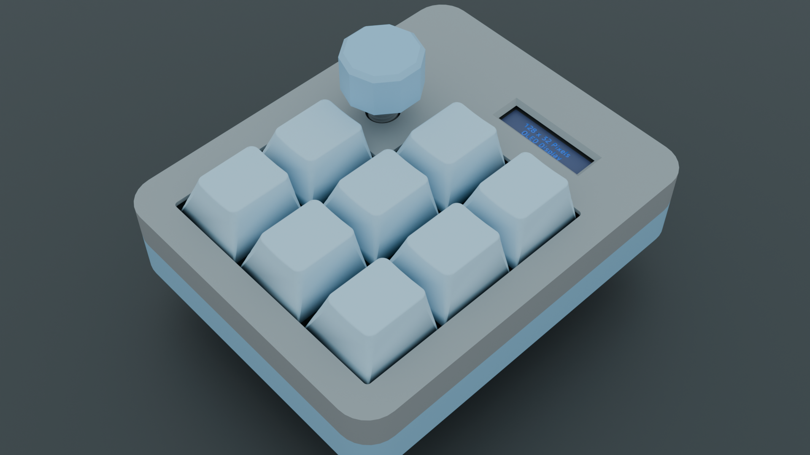
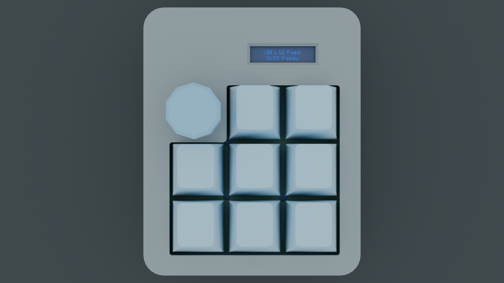
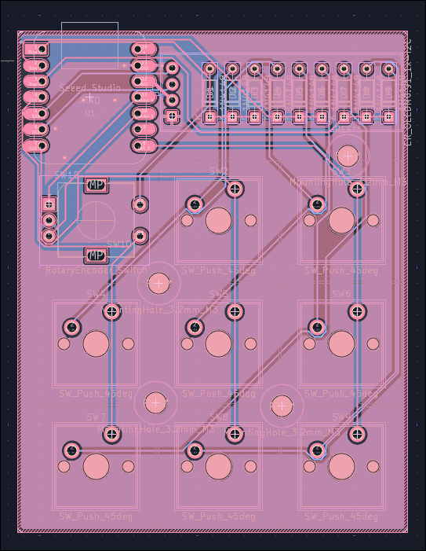
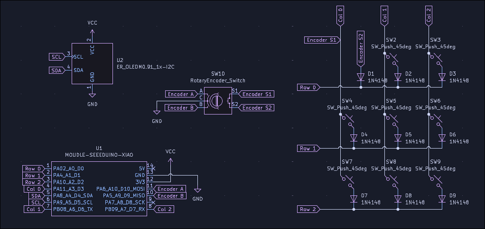

# Hackypad

A simple little 8-key macropad based on the RP2040 running qmk firmware

## Features

- 8 Programmable keys
- EC11 Encoder
- 128x32 OLED Display

## CAD Model

## PCB

### Schematic

## Firmware

The firmware is set up with a basic keymap.
The display should also work, though I will have to test it.
Might switch to the RMK frimware in the future.

## BOM

| Item                | Qnt |
|-------------------- | --- |
| Xiao RP2040         | 1   |
| EC11 Encoder        | 1   |
| 0.91" OLED Display  | 1   |
| MX Switch           | 8   |
| 1N4148 Diode        | 9   |
| DSA Keycap          | 8   |
| M3 Screw            | 4   |
